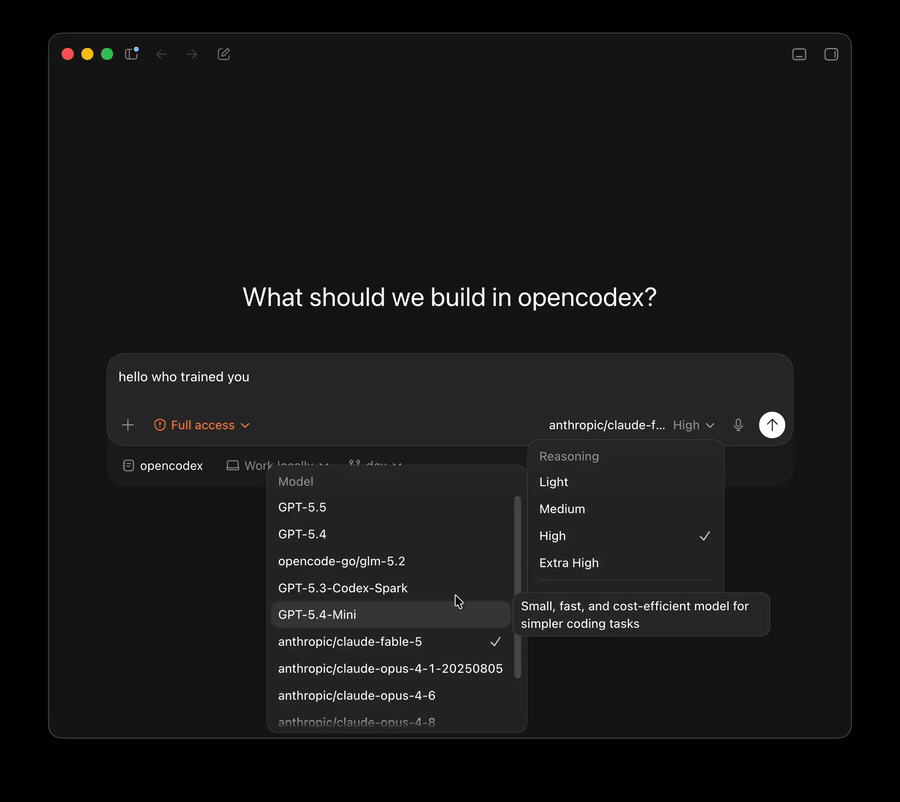
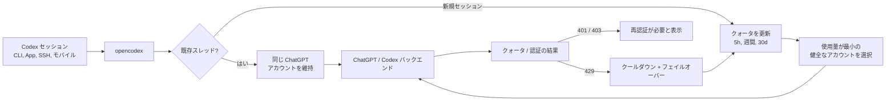
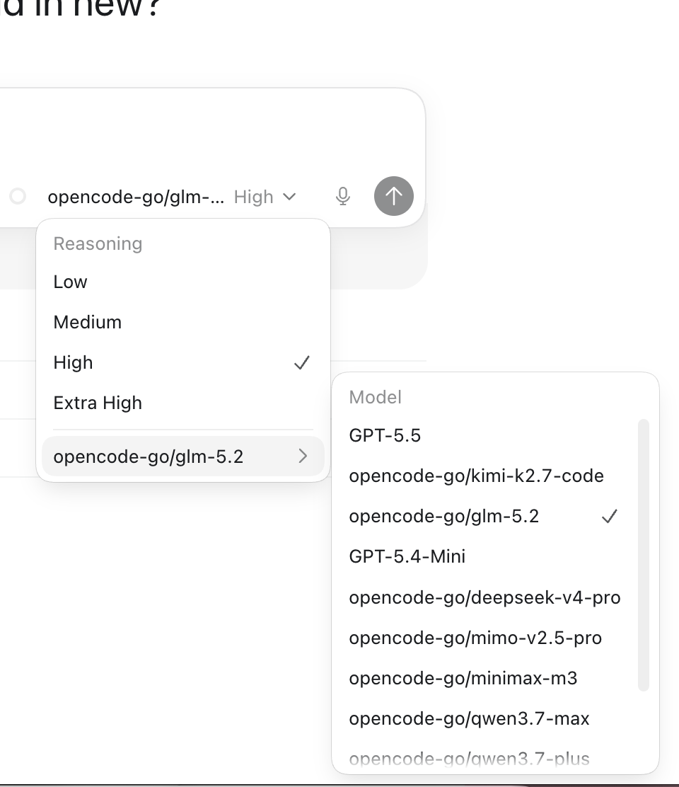

<h3 align="center">make codex open!</h3>
<p align="center"><b>OpenAI Codex &amp; Claude Code 向けの汎用プロバイダープロキシ</b> — Codex CLI・App・SDK と Claude Code で任意の LLM を使えます。</p>
<p align="center"><code>npm install -g @bitkyc08/opencodex</code> · <code>ocx start</code> · <b>localhost:10100</b></p>

<p align="center">
  <a href="https://www.npmjs.com/package/@bitkyc08/opencodex"></a>
  <a href="https://github.com/lidge-jun/opencodex/blob/main/LICENSE"></a>
  
</p>

<p align="center">
  
</p>

<p align="center">
  <a href="README.md">English</a> · <a href="README.ko.md">한국어</a> · <a href="README.zh-CN.md">简体中文</a> · <a href="README.ru.md">Русский</a> · <b>日本語</b> · 📖 <a href="https://lidge-jun.github.io/opencodex/ja/"><b>完全なドキュメント →</b></a>
</p>

<p align="center">
  
</p>

Claude、Gemini、Grok、GLM、DeepSeek、Kimi、Qwen、Ollama など、任意の LLM を Codex で — そして **Claude Code** でも — 使えます。誰かがサポートを追加してくれるのを待つ必要はありません。

opencodex は Codex の Responses API をプロバイダーが話すプロトコルに変換する、軽量なローカルプロキシです。ストリーミング、ツール呼び出し、推論トークン、画像 — すべて双方向で動作します。

<p align="center">
  
</p>
<p align="center"><sub><b>Codex で任意のモデルを。</b> プロバイダーを選ぶだけ — 同じ Codex ワークフローで、違う頭脳。</sub></p>

Codex 認証のための **ChatGPT アカウントプール**も管理できます。複数の ChatGPT / Codex アカウントを追加し、
ダッシュボードで 5 時間 / 週間 / 30 日クォータを更新し、新しいセッションを最も使用量の少ない健全なアカウントに自動
ルーティングできます。既存の Codex スレッドはそれを開始したアカウントに固定されたままなので、長い SSH・tmux・モバイル接続
セッションが会話の途中でアカウントを切り替えることはありません。

```
Codex CLI / App / SDK ──/v1/responses──▶ opencodex ──▶ Any provider
                                              │
              Anthropic · Google · xAI · Kimi · Ollama Cloud · Groq
              OpenRouter · Azure · DeepSeek · GLM · …and OpenAI itself
```



## 対応プラットフォーム

| OS | サポート状況 | サービスマネージャー |
|---|---|---|
| macOS (arm64 / x64) | 完全対応 | launchd |
| Linux (x64 / arm64) | 完全対応 | systemd (user unit) |
| Windows (x64) | 完全対応 | Task Scheduler (hidden) / オプトインのネイティブサービス (`--native`, WinSW) |

[Node](https://nodejs.org) 18+ が必要です。Bun ランタイムは `npm install` 時に自動でバンドルされるので、別途 Bun をインストールする必要はありません。3 つのプラットフォームすべてがネイティブで動作します(Windows でも WSL 不要)。

## クイックスタート

```bash
# インストール(Bun ランタイムを自動バンドル — Node 18+ のみ必要)
# ユーザー所有の Node(nvm/fnm)を推奨 — `sudo npm install -g …` は避けてください
npm install -g @bitkyc08/opencodex

# 対話型セットアップ(config の書き出し + Codex への注入 + 自動起動 shim のインストールを提案)
ocx init

# プロキシを起動
ocx start

# init でスキップした場合は、後からオンデマンド自動起動 shim をインストール
ocx codex-shim install

# Codex をいつも通り使う — opencodex 経由でルーティングされます
codex "Write a hello world in Rust"
```

<details>
<summary><b>"bundled Bun runtime is missing" エラー / npm が Bun インストールスクリプトをブロックした?</b></summary>

<br/>

opencodex は Bun ランタイムを依存関係としてバンドルし、Node ランチャー経由で実行するため、Bun を自分でインストールする必要は**ありません**。"bundled Bun runtime is missing" エラーが出る場合、インストール時にライフサイクルスクリプト(npm が `allowScripts` で bun の postinstall をブロックした場合を含む)やオプション依存がスキップされています。bun のインストールスクリプトを許可して再インストールしてください:

```bash
npm install -g --allow-scripts=bun @bitkyc08/opencodex   # --ignore-scripts, --omit=optional なしで

# 最初に sudo でインストールした場合は sudo を維持してください:
sudo npm install -g --allow-scripts=bun @bitkyc08/opencodex
```

npm の警告が提案する省略コマンドにはパッケージ名が含まれておらず、
現在のディレクトリを再インストールしてしまいます。常に `@bitkyc08/opencodex` を明示してください。

sudo で root 所有のプレフィックスにインストールした場合、上の sudo 再インストールでそのプレフィックスの
ブロックが解除されますが、可能な場合はユーザー所有の Node(nvm、fnm、ユーザー npm プレフィックス)への移行を推奨します。

</details>

## プロバイダーを追加

最も簡単な方法はウェブダッシュボードを使うことです。

```bash
ocx gui
```

`http://localhost:10100` のダッシュボードが開きます。ここから:

1. **"Add Provider"** をクリックしてください。
2. **40 以上の組み込みプロバイダー** から選ぶか、カスタムの OpenAI 互換エンドポイントを入力してください。
3. API キーを貼り付けてください(Anthropic、xAI、Kimi は OAuth ログインも可能)。
4. プロバイダーの `/v1/models` エンドポイントからモデルが **自動検出** されます。

追加したプロバイダーは再起動なしで即座に使えます。

`ocx init`(対話型 CLI)や `~/.opencodex/config.json` の直接編集からもプロバイダーを追加できます。

## モデルルーティング

`provider/model` 形式で任意のモデルを直接指定できます:

```bash
# Anthropic 経由で Claude Opus を使用
codex -m "anthropic/claude-opus-4-8" "このスタックトレースを説明して"

# Google 経由で Gemini を使用
codex -m "google/gemini-3-pro" "auth.ts のユニットテストを書いて"

# Ollama Cloud 経由で GLM を使用
codex -m "ollama-cloud/glm-5.2" "SQL マイグレーションを書いて"

# Ollama 経由でローカルモデルを使用
codex -m "ollama/llama3" "この関数をリファクタリングして"
```

`provider/` 接頭辞を省略すると、opencodex はデフォルトプロバイダーにルーティングするか、モデル名のパターンで自動
マッチします(例: `claude-*` は Anthropic、`gpt-*` は OpenAI)。

ルーティングされたモデルは **Codex App** のモデルピッカーにも、モデルごとの推論負荷コントロールと共に表示されます:

現在の Codex ビルドは、モデルが対応を宣言している場合 `low`、`medium`、`high`、`xhigh`、`max`、`ultra` の推論
コントロールを表示できます。opencodex はプロバイダー config が明示的にエイリアスを指定しない限り
`xhigh` と `max` を異なる段階として保持します。`ultra` は上流の Codex と同じ意味です:
クライアントで最大推論と能動的マルチエージェント委任を有効にし、実際のリクエストは `max` に変換されて
送信されます。ルーティングモデルは `reasoningEfforts` config でオプトインした場合のみ `ultra` を宣言します。

GPT-5.6 Sol/Terra/Luna は OpenAI API キーおよび OpenRouter プリセットで rollout-ready カタログエントリとして
シードされます(`gpt-5.6-sol`、`gpt-5.6-terra`、`gpt-5.6-luna`; OpenRouter は `openai/...` を使用)。
スペックは upstream models.json スナップショットに従います — Sol/Terra は `ultra` まで、Luna は `max` まで
宣言し、Sol のデフォルト推論は `low` です。実際の
利用可否は upstream preview gate に従い、opencodex はアカウント/プロバイダーが提供時に使う
ルーティング/カタログメタデータを準備しておきます。

<p align="center">
  
</p>

## OpenAI プロバイダーのアカウントモード

| プロバイダー ID | ルート | 認証情報 | 動作 |
|---|---|---|---|
| `openai` | Codex ログイン | メイン + 追加 Codex アカウント | デフォルトで Pool、選択可能な Direct モード |
| `openai-apikey` | OpenAI API | API キー/キープール | Codex アカウントのルーティングなし |

- Pool はメインログインと追加アカウントを含み、アフィニティ・クォータ・クールダウン・フェイルオーバーを適用します。
- Direct はプール状態を触らず、現在の caller/メインログインの bearer のみを使います。
- 新規インストールとモード未設定の config は Pool がデフォルトです。ダッシュボードの **Providers** でモードを変更しても
  `gpt-5.6-sol` のような bare モデル ID はそのままです。
- `openai-apikey/gpt-5.6-sol` は API を選択し、Codex ログインと API 認証情報の間にフォールバックはありません。
- 現在のマーカーは `openaiProviderTierVersion: 2` で、オリジナルは
  `~/.opencodex/config.json.pre-openai-tiers-v2.bak` に保存されます。
  復元: `cp ~/.opencodex/config.json.pre-openai-tiers-v2.bak ~/.opencodex/config.json`
- 以前の v1 3 プロバイダー config は単一の `openai` 行に自動移行されます。
- API ティアの GPT-5.6 メタデータは context 1,050,000 / max input 922,000 です。
  `gpt-5.6-sol-pro`、`terra-pro`、`luna-pro` は公開 virtual ID を維持しつつ、wire ではベース ID と
  `reasoning.mode: "pro"` で送信されます。

### Pool アカウントの動作

ダッシュボードの **Codex 認証** を開いてプールアカウントを追加し、次の Codex セッションをどのアカウントが処理するか選んでください。
opencodex は 2 つの動作を分離して保持します:

- **既存セッションはアフィニティを維持します。** スレッド ID が選択されたアカウントにバインドされ、以降のターンで再利用されるため、
  長いリクエストやモバイル/SSH 接続セッションは同じアカウントを使い続けます。
- **新規セッションは自動ルーティングされます。** 自動切り替えがオンの場合、opencodex は 5 時間・週間・30 日の使用量のうち最も
  ホットなクォータ枠を比較し、アクティブアカウントがしきい値を超えると新規セッションを使用量の少ない適格アカウントに送ります。
- **クォータ照会が組み込まれています。** ダッシュボードで全アカウントのクォータを一括更新でき、リクエストログは
  プールトラフィックを非 PII のアカウント序数でラベリングします。
- **失敗はフェイルクローズドです。** トークン失敗は別の認証情報に黙ってフォールバックせず、再認証をマークします。
  429 クォータ応答はアカウントをクールダウンに置き、以降の作業を別の適格プールアカウントにフェイルオーバーできます。

## 主な機能

- **任意の LLM を Codex で。** 5 つのプロトコルアダプターが Anthropic Messages、Google Gemini、Azure、OpenAI Responses パススルー、そしてすべての OpenAI 互換 Chat Completions エンドポイントをカバーします — つまり組み込みで **40 以上のプロバイダー**です。
- **Claude Code でも任意の LLM を。** 同じデーモンが Anthropic Messages API(`/v1/messages` + `count_tokens`)を提供します: `ocx claude` が Claude Code を完全に接続された状態で起動し、ルーティングモデルがゲートウェイモデルディスカバリでネイティブ `/model` ピッカーに表示されます(`claude-ocx-<provider>--<model>` エイリアス、Claude Code 2.1.129+)。スロットとモデルマッピングはダッシュボードの Claude ページで設定します。
- **ChatGPT アカウントを安全にプール。** 既存の Codex スレッドは一つのアカウントに維持しつつ、新規セッションはクォータ更新と非 PII リクエトラベルと共にプールから使用量の少ないアカウントを自動選択できます。
- **一度ログインすれば API キーは省略可。** xAI、Anthropic、Kimi は OAuth をサポートするので既存アカウントで認証でき、トークンは自動更新されます。または `codex login` を転送、API キーを貼り付け、`${ENV_VAR}` 参照を使えます — 自由に選べます。
- **Codex が動くすべての場所で。** Codex CLI、TUI、App、SDK に自動で注入されます。ルーティングモデルはネイティブモデルと同様に Codex モデルピッカーに表示されます。
- **履歴セーフな注入。** ローカルインストールではプロキシは Codex 自身の組み込み `openai` プロバイダーを単一の `openai_base_url` 行で自身に向けるため、新しいスレッドはネイティブのプロバイダータグを維持し、進行中のチャット履歴が再マッピングされることはなく、クリーンでないシャットダウンでも隠せません。(古いバージョンで再タグ付けされたスレッドは初回起動時に一度だけマイグレートされます; リモート/LAN バインドは API キーヘッダーが必要なため、専用のプロバイダーエントリを使用します。)
- **適切なモデルに委任。** ダッシュボードや config から最大 5 つのルーティング/ネイティブモデルを Codex サブエージェントピッカーに公開し、複雑なタスクは推論モデルへ、高速なタスクは安価なモデルへ送れます。v2 マルチエージェントサーフェス(GPT-5.6 Sol/Terra)ではプロキシが簡潔な委任ガイダンスを注入します。推奨サブエージェントモデル・負荷(`injectionModel` / `injectionEffort`)、公開モデルロスターと各モデルが対応する負荷ラダー、そしてクロスモデル `spawn_agent` オーバーライドを適用する `fork_turns` ルールまで。既知の制限: ネイティブの親がルーティング子をスポーンすると、タスク本文がバックエンド暗号化状態で到着し失われることがあります([#92](https://github.com/lidge-jun/opencodex/issues/92)) — 安定したクロスプロバイダー委任には v1 サーフェスを使ってください。表現を自分で書きたい場合は `injectionPrompt` に `{{model}}` / `{{effort}}` / `{{roster}}` プレースホルダーを入れてください。
- **preview gate された OpenAI ロールアウトに備える。** GPT-5.6 Sol/Terra/Luna の負荷ラダーを保存します。Direct/Multi は 372k Codex 契約を、OpenAI API と OpenRouter は 1.05M メタデータを使います。
- **任意のモデルに超能力を。** OpenAI 以外のモデルも ChatGPT ログイン上で動く `gpt-5.4-mini` サイドカーで本当のウェブ検索と画像理解を得られます。
- **画像をネイティブに生成。** Codex の独立型 `image_gen` ツールは生成時に `POST /v1/images/generations`、編集時に `POST /v1/images/edits` を使います。Responses のホスト型 `image_generation` ツールとは別物です。
- **何が起きているかを可視化。** ウェブダッシュボードがプロバイダー、OAuth 状態、モデル選択、upstream が報告した cached/cache-write トークン数を含むライブリクエストログを表示します — なぜリクエストが失敗したか推測する必要はもうありません。
- **バックグラウンド実行。** システムサービス(launchd / systemd / Task Scheduler)としてインストールすれば起動時に自動開始され、気にする必要がありません。
- **クリーンな終了、残留ゼロ。** `ocx stop`(またはダッシュボードの Stop ボタン)はプロキシを終了し、インストールされたバックグラウンドサービスを停止し、Codex を元の設定に復元します。その後 `codex` は残留設定やゾンビプロセスなしに以前と同じように動作します。

## プロバイダーとアダプター

| プロバイダー | アダプター | 認証方式 |
|---|---|---|
| OpenAI(ChatGPT ログイン) | `openai-responses` | 転送(キー不要) |
| OpenAI(API キー) | `openai-responses` | key |
| Umans AI Coding Plan | `anthropic` | key |
| Anthropic Claude | `anthropic` | oauth / key |
| xAI Grok | `openai-chat` | oauth / key |
| Kimi (Moonshot) | `openai-chat` | oauth / key |
| Google Gemini | `google` | key |
| Azure OpenAI | `azure-openai` | key |
| Ollama Cloud + 17 プロバイダーカタログ | `openai-chat` | key |
| Ollama / vLLM / LM Studio(ローカル) | `openai-chat` | key(通常は空欄) |
| 任意の OpenAI 互換エンドポイント | `openai-chat` | key |

このほか DeepSeek、Groq、OpenRouter、Together、Fireworks、Cerebras、Mistral、Hugging Face、NVIDIA NIM、MiniMax、Qwen Cloud などがあります。完全な一覧は `ocx init` または[プロバイダードキュメント](https://lidge-jun.github.io/opencodex/ja/reference/configuration/)で確認してください。

Cursor サポートは段階的な実験的ブリッジです: `ocx init` とダッシュボードの Add Provider ピッカーに Cursor の静的公開モデルカタログを持つローカル config として表示されます。Cursor アクセストークンを設定するとライブ
HTTP/2 トランスポートが有効になります。Cursor サーバー駆動のネイティブ
read/write/delete/ls/grep/shell/fetch 実行は、Codex の承認とサンドボックスパスをバイパスするためデフォルトで無効です; 信頼できるローカル
実験でのみ `unsafeAllowNativeLocalExec: true` を設定してください。
MCP、画面録画、computer-use はエグゼキューターフック経由で公開されます; ローカルエグゼキューターが未設定の場合、
opencodex はポリシーでブロックする代わりに型付きの no-executor 結果を返します。
Cursor OAuth とライブモデルディスカバリは実験的 Cursor アダプターで有効です。

## CLI

```bash
ocx init                       # 対話型セットアップ
ocx start [--port 10100]       # プロキシ起動; ポートが使用中なら空きポートに自動切替
ocx stop                       # プロキシ停止 + Codex を元の設定に復元
ocx restore                    # 停止せずに復元(エイリアス: ocx eject)
ocx uninstall                  # service/shim/config を削除 + Codex をオリジナルに復元
ocx ensure                     # 必要時に起動 + Codex config/cache を更新
ocx sync                       # モデルを更新 + Codex に再注入
ocx status                     # プロキシは起動中か?
ocx login <provider>           # OAuth ログイン(xai, anthropic, kimi, cursor, ...)
ocx logout <provider>          # 保存されたログインを削除
ocx account <list|current|use> # アカウント/API キープールの一覧・切替(マスク済み; refresh/auto-switch/remove/add-key 含む)
ocx gui                        # ウェブダッシュボードを開く
ocx claude [args...]           # プロキシに接続した Claude Code を起動(モデルディスカバリ オン)
ocx codex-shim install         # codex 起動時に `ocx ensure` を実行
ocx service [install|start|stop|status|uninstall]   # バックグラウンドサービスのインストール/更新/開始
ocx update [--tag preview]     # opencodex を更新; preview インストールは @preview を維持
```

### 自動起動: service vs shim

opencodex にはプロキシを自動起動する方法が 2 つあります:

| | `ocx service` / `ocx service install` | `ocx codex-shim install` |
|---|---|---|
| **方式** | OS サービスマネージャー(launchd / systemd / schtasks) | `codex` スクリプトランチャーをラップし実際の `codex.exe` は触らない |
| **タイミング** | ログイン後に常時実行 | オンデマンド — `codex` 起動時に `ocx ensure` を実行 |
| **再起動** | クラッシュ時に自動再起動 | `codex` 呼び出しごとに 1 回起動 |
| **Codex 更新** | 影響なし | `ocx codex-shim install` または `ocx update` 時に修復 |
| **削除** | `ocx service uninstall` | `ocx codex-shim uninstall` |

常にプロキシを起動しておくには **service**(開発マシン推奨)、軽くオンデマンドで使うには **shim** を使ってください。
shim 自動起動はデフォルトでオンで、GUI ダッシュボードからオフにできます。設定されたプロキシポートが既に使用
中の場合、`ocx start` が自動的に別の空きローカルポートを選び、Codex の設定もそのポートに更新します。

### アンインストール

npm パッケージを削除する前に、ローカル状態を先に片付けてください:

```bash
ocx uninstall
npm uninstall -g @bitkyc08/opencodex
```

`ocx uninstall` はプロキシの停止、インストールされた service の削除、Codex shim の削除、Codex config/catalog/history の
復元、`~/.opencodex` の削除を行います。

## 設定

設定ファイルは `~/.opencodex/config.json` に保存されます。ファイルが壊れている場合(不正な JSON など)
opencodex は `config.json.invalid-<timestamp>` にバックアップし、警告を出力した上でデフォルトで起動します。
オリジナルファイルが黙って消えることはありません。

最小設定の例:

```json
{
  "port": 10100,
  "defaultProvider": "anthropic",
  "providers": {
    "anthropic": {
      "adapter": "anthropic",
      "baseUrl": "https://api.anthropic.com",
      "authMode": "oauth",
      "defaultModel": "claude-sonnet-4-6"
    },
    "ollama-cloud": {
      "adapter": "openai-chat",
      "baseUrl": "https://ollama.com/v1",
      "apiKey": "${OLLAMA_API_KEY}",
      "defaultModel": "glm-5.2"
    }
  }
}
```

プロバイダーエントリにはルーティングカタログメタデータも併記できます。`contextWindow` はプロバイダー
全体に適用される Codex 表示用コンテキスト上限、`modelContextWindows` はモデル別上限、
`modelInputModalities` は `["text"]` や `["text", "image"]` のようなモデル別入力ヒントです。これらの値はライブ
`/models` メタデータを上限として制限するだけで、より小さいライブコンテキストを増やすことはありません。バンドルされた GPT-5.6
Sol/Terra/Luna のフォールバックメタデータは OpenAI API キーと OpenRouter カタログエントリに 1,050,000 トークンの
コンテキストウィンドウを使用し、upstream preview アクセスをバイパスしません。全フィールドは設定リファレンスを
参照してください。

> **Z.AI 経由の GLM-5.2 1M コンテキスト:** `openai-chat` アダプターでは `glm-5.2` と `glm-5.2[1m]` が両方とも
> 動作します — opencodex がリクエスト前に末尾の `[1m]` 接尾辞を削除するためです(OpenAI 互換エンドポイントは
> 大括弧 ID を拒否、Z.AI 400 code 1211)。`[1m]` 接尾辞は Claude-Code / Anthropic エンドポイントの慣習で、
> ネイティブに使うには `anthropic` アダプターを Z.AI コーディングベース(`https://api.z.ai/api/coding/paas/v4`)に
> 向けてください。1M コンテキストウィンドウはモデル名ではなくモデルカタログ(`modelContextWindows`)で設定します。

ローカルモデルも動作します。opencodex をマシンで動いている OpenAI 互換サーバーに向けてください:

```json
{
  "port": 10100,
  "defaultProvider": "ollama",
  "providers": {
    "ollama": {
      "adapter": "openai-chat",
      "baseUrl": "http://localhost:11434/v1",
      "authMode": "key",
      "apiKey": "",
      "defaultModel": "llama3"
    },
    "vllm": {
      "adapter": "openai-chat",
      "baseUrl": "http://localhost:8000/v1",
      "authMode": "key",
      "apiKey": "",
      "defaultModel": "Qwen/Qwen3-32B"
    }
  }
}
```

WebSocket トランスポートはデフォルトでオフです。Codex が HTTP/SSE の代わりに Responses WebSocket パスを使うようにするには `"websockets": true` を設定してください。

### リモートアクセス

デフォルトで opencodex は `127.0.0.1`(ループバック)にバインドされ、追加の認証は不要です。
`"hostname": "0.0.0.0"` で LAN に公開する場合、opencodex は管理 API(`/api/*`)とデータプレーン
(`/v1/responses`、`/v1/images/generations`、`/v1/images/edits`)の両方に bearer トークンを要求します:

```bash
export OPENCODEX_API_AUTH_TOKEN="your-secret-token"
ocx start
```

非ループバックバインド時にこの環境変数がないとプロキシの起動は拒否されます。LAN アクセス用のバックグラウンド
サービスをインストールする場合も、同じシェルでこの変数を先に設定してから `ocx service install` を実行してください。
クライアント(スクリプト、リモートマシン)はすべてのリクエストにトークンを含める必要があります:

```
x-opencodex-api-key: your-secret-token
```

トークンはタイミング攻撃を防ぐため定数時間で比較されます。

opencodex は Codex resume 履歴を自動でリマップし、古い OpenAI チャットと opencodex が作成したプロジェクト
スレッドがプロキシ有効中に Codex App に表示され続けるようにします。オリジナルの provider/source メタデータは
`~/.opencodex/codex-history-backup.json` に記録されます。`ocx stop` / `ocx restore` はバックアップされた OpenAI 行を
OpenAI に復元し、残った opencodex ユーザースレッドも OpenAI にイジェクトして、ネイティブ Codex が `config.toml` に
もう存在しないプロバイダーのスレッドを resume しようとして失敗しないようにします。

バックアップ対応ができる前の古い開発ビルドで `syncResumeHistory` がすでに履歴をリマップしていた場合、明示的
復元コマンドを実行できます:

```bash
ocx recover-history --legacy-openai
```

全フィールドの詳細は **[設定リファレンス](https://lidge-jun.github.io/opencodex/ja/reference/configuration/)** を参照してください。

## ドキュメント

公開ドキュメント(インストール、プロバイダー、ルーティング、サイドカー、Codex 統合、Codex App モデルピッカー、CLI/設定リファレンス)は [`docs-site/`](./docs-site) の Astro サイトとしてビルドされ
**[lidge-jun.github.io/opencodex](https://lidge-jun.github.io/opencodex/ja/)** に公開されます。

メンテナ用の source of truth は [`structure/`](./structure) に、過去の調査/診断ノートは [`docs/`](./docs) にあります。

## 開発

```bash
git clone https://github.com/lidge-jun/opencodex.git
cd opencodex
bun install
bun run dev:proxy    # dev モードでプロキシ API を起動
bun run dev:gui      # 別のターミナルでダッシュボード dev サーバーを起動
bun x tsc --noEmit   # 型チェック
```

`bun run dev` は互換性のため `bun run dev:proxy` のエイリアスとして残っています。ソースチェックアウトでプロキシ
API は `/healthz`、`/v1/responses`、`POST /v1/images/generations`、`POST /v1/images/edits`、`/api/*` を
公開し、`GET /` は `bun run build:gui` が `gui/dist` を生成した後にのみパッケージされたダッシュボードを提供します。
ダッシュボードを編集する際はフロントエンドを別途起動してください:

```bash
bun run dev:gui
```

**[コントリビュート](https://lidge-jun.github.io/opencodex/ja/contributing/)** を参照してください。

## 免責事項

opencodex は独立したコミュニティプロジェクトであり、**OpenAI、Anthropic などいかなるプロバイダーとも提携したり推奨を受けたりしていません。**

一部のプロバイダー — 特に Anthropic (Claude) — はサードパーティプロキシ経由の API トラフィックルーティングでアカウントを停止または制限する場合があります。**使用の責任は自己にあります(UAYOR)。** プロバイダーを接続する前に、該当する利用規約でプロキシベースのアクセスが許可されているか確認してください。opencodex メンテナは上流プロバイダーによるアカウント措置について責任を負いません。

## ライセンス

MIT
